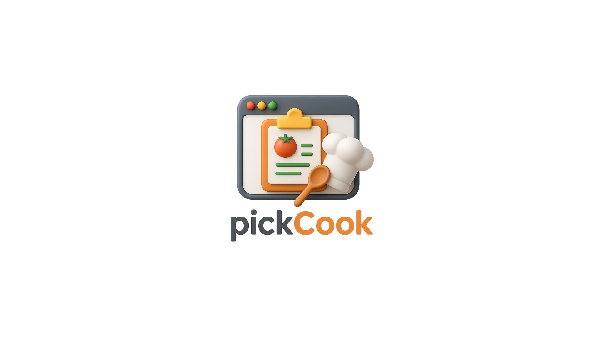

 

<h1 align="center" style="color: #FFD675;">🍽️ PickCook </h1> 

  

<h3 align="center">5팀 - Team CookBuddy </h3> 

## 🕵️ 팀원 소개

|  |  |  |  |  |
| :----------------------------------------------------------------------------------------------------------------------------------------------------------------: | :--------------------------------------------------------------------------------------------------------------------------------: | :-----------------------------------------------------------------------------------------------------------------------------------------------------: | :-----------------------------------------------------------------------------------------------------------------------------------------------------: | :-----------------------------------------------------------------------------------------------------------: |
|                                                   🐰 **김아영** [@thay123028](https://github.com/thay123028)                                                   |                                    🧶 **김영재** [@young1042](https://github.com/young1042)                                    |                                           ⚽ **허정빈** [@jeongbin5211](https://github.com/jeongbin5211)                                            |                                              🤪 **허정우** [@JohnHeo81](https://github.com/JohnHeo81)                                               |                         🐢 **홍서연** [@seoyeon22](https://github.com/seoyeon22)                          |

   

## 📌 프로젝트 소개

PickCook은 냉장고 속 재료를 등록해 재고와 유통기한을 관리하고, 그 재료로 만들 수 있는 요리를 추천해주는 플랫폼입니다. 만들고 싶은 요리를 고르면 필요한 재료도 알려주고, 부족한 재료는 바로 구매할 수 있어 요리가 더 쉬워집니다.

 

## 🔗 접속 주소

## 🛠️ 기술 스택

### 프론트엔드

  

### 협업 & 기타

 

## 🖼️ Figma 설계

### 📄 페이지 설계

### 🧩 컴포넌트 설계

## 🔍 프로젝트 시연
