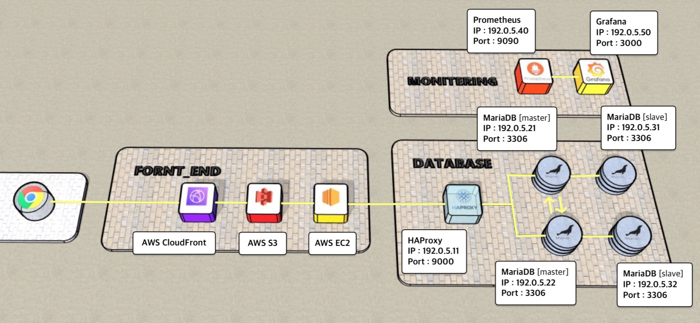
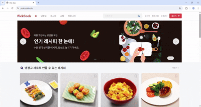
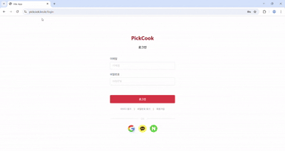
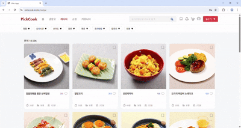
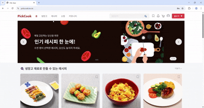
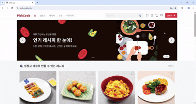
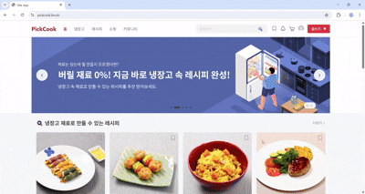
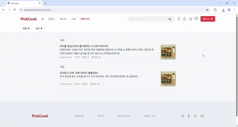

 

<h1 align="center" style="color: #FFD675;">🍽️ PickCook </h1> 

  

<h3 align="center">5팀 - Team CookBuddy </h3> 

## 🕵️ 팀원 소개

|  |  |  |  |  |
| :----------------------------------------------------------------------------------------------------------------------------------------------------------------: | :--------------------------------------------------------------------------------------------------------------------------------: | :-----------------------------------------------------------------------------------------------------------------------------------------------------: | :-----------------------------------------------------------------------------------------------------------------------------------------------------: | :-----------------------------------------------------------------------------------------------------------: |
|                                                   🐰 **김아영** [@thay123028](https://github.com/thay123028)                                                   |                                    🧶 **김영재** [@young1042](https://github.com/young1042)                                    |                                           ⚽ **허정빈** [@jeongbin5211](https://github.com/jeongbin5211)                                            |                                              🤪 **허정우** [@JohnHeo81](https://github.com/JohnHeo81)                                               |                         🐢 **홍서연** [@seoyeon22](https://github.com/seoyeon22)                          |

  

## 📌 프로젝트 소개

PickCook은 냉장고 속 재료를 등록해 재고와 유통기한을 관리하고, 그 재료로 만들 수 있는 요리를 추천해주는 플랫폼입니다. 만들고 싶은 요리를 고르면 필요한 재료도 알려주고, 부족한 재료는 바로 구매할 수 있어 요리가 더 쉬워집니다.

 

## PickCook 프로젝트 배경 
먹는것은 사람에게 아주 중요한 일이다. 외식값이 올라가고 원재료값이 올라가면서 사람들에게 많은 부담을 주고있다. 
그로인해 집에서 음식을 해먹는 사람들이 많아지는데 실패를 하며 요리를 해나가는 것은 재료비 부담이 크다. 
그래서 성공하는 요리레시피 맛있고 후회하지않는 레시피에 더불어 자신이 가지고있는 재료와 부족한 재료를 바로 파악하여 
사용자가 무슨재료가 필요하지? 라는 의문을 가질 시간을 줄여주고 부담없는 음식을 만들수 있게 
자신의 냉장고 재고기반 레시피 추천마켓 PickCook서비스를 구축하였다.

- 냉장고 재고입력 기반 재고정보 파악과 관련레시피 추천: 재고를 수작업으로 입력하거나 사진을 찍어서 올리면 카메라에서 인지하는 기능이 
물체를 인식해 재고를 등록한다. 이를통해 추후 레시피 추천에서 해당음식을 만들고자 할 때 부족한 재료가 있으면 알려준다.
- 레시피 글 좋아요 순으로 추천: 레시피 글 중에서 좋아요가 많이 눌린 레시피를 추천해주는 기능
- 장바구니 기능으로 구매할 제품 파악: 마음에 드는 레시피나 상품이 있다면 장바구니에 넣을 것이다. 제품코드와 제품명으로 특정하여 
자신이 장바구니에 담은 가격의 총합을 알 수 있고 장바구니란 기능을 통해 한번 더 고민하여 합리적인 소비를 할 수 있게된다.
- 구매한 제품에 대해 배송여부와 반품여부 파악: 해당 제품이 지금 배송중인지 배송완료했는지 배송중이라면 누가 배송을 하는지를 파악해 배송이 안전히 이뤄지는지 파악할 수 있다.
- 커뮤니티 기능으로 사람들의 요리경험이나 다양한 대화창구 형성: 커뮤니티 기능이 단순 소통이 아닌 

## 🔗 접속 주소

[https://www.pickcook.kro.kr/](https://www.pickcook.kro.kr/)

## 🛠️ 기술 스택

### 프론트엔드

  

### 협업 & 기타

 

## 🖼️ Figma 설계

[Figma 링크](https://www.figma.com/design/I8x27F4wnRhe4leKxO4DhB/CookBuddy?node-id=0-1&t=b1VVHtxPF7muyIcN-1)

### 📄 페이지 설계

### 🧩 컴포넌트 설계

## 아키텍쳐 설계

## 🔍 프로젝트 시연

  
로그인

  

  
   
  

 

  
회원가입

  

  
   
  

 

  
로그아웃

  

  
   
  

 

  
레시피

  

  
   
  

 

  
레시피 상세 페이지

  

  
   
  

 

  
냉장고

  

  
   
  

 

  
커뮤니티

  

  
   
  

 

  
글쓰기

  

  
   
  

